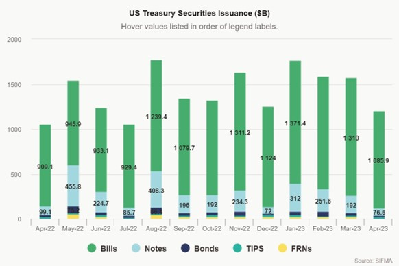
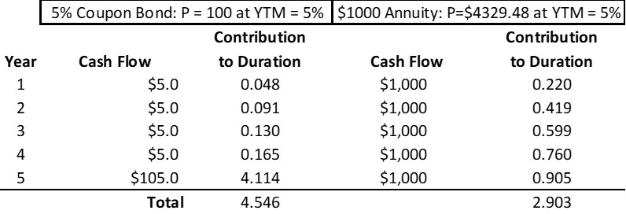
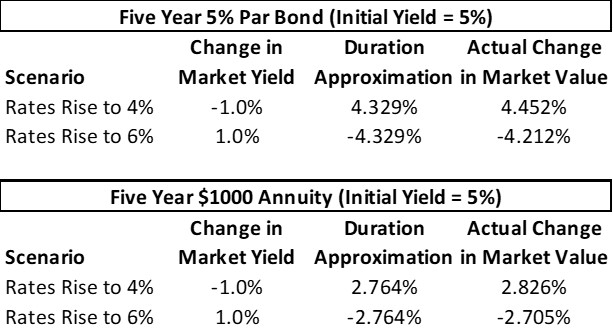
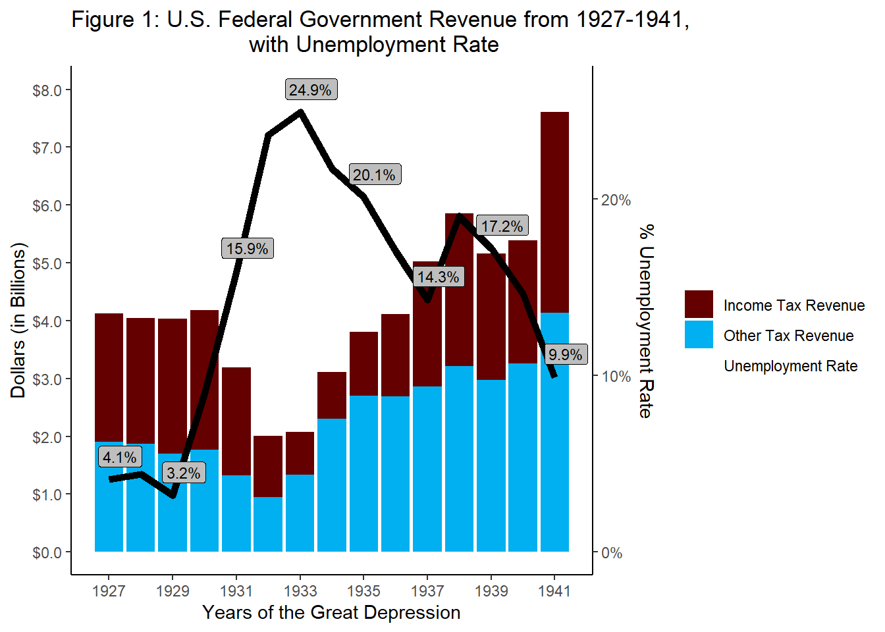
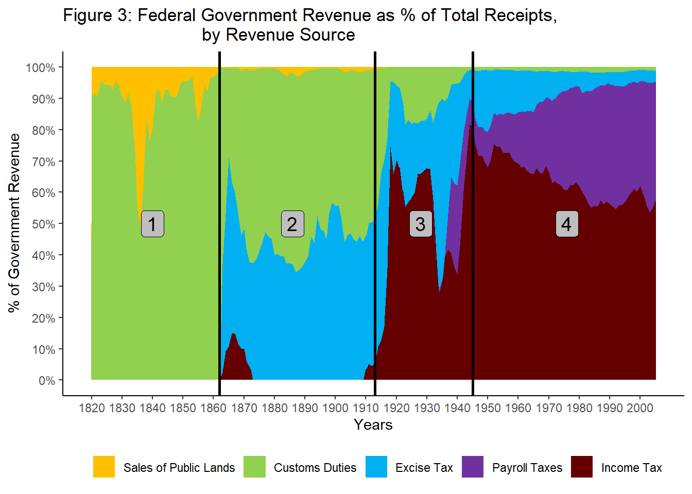
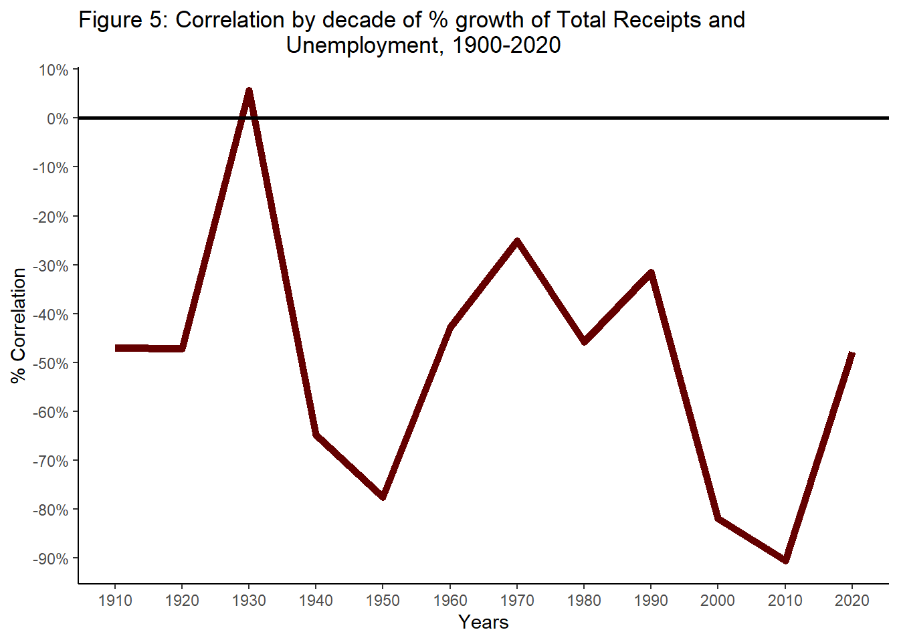
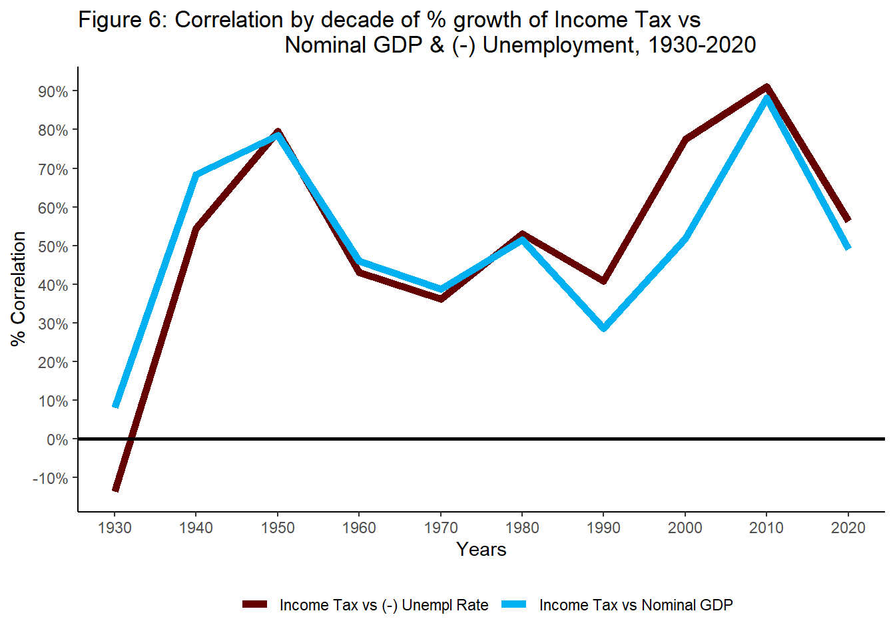
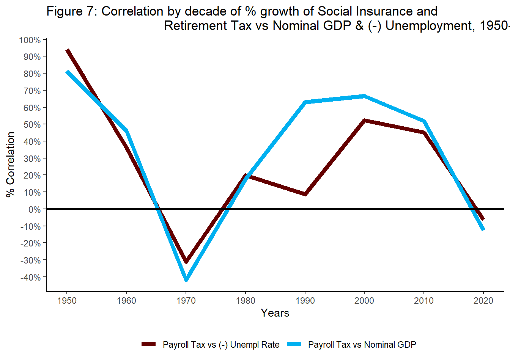

My empirical work in public finance and economic history — three papers,
each summarized up top with its **full original treatment and figures below**.
The data behind each paper is linked from the [Data](data.html) page.

# Duration and Public Finance

## **Duration and Public Finance in the United States, 2001-2023**

#### By Nick Anderson

#### Dated 2023.05.19

Sources: [Data](data.html)

**Replication:** data and processing scripts are available on the
[Data](data.html) page; a self-hosted data download mirror is *temporarily offline — server migration*;
the [Data](data.html) page’s Google Drive mirror carries the same files.

### Introduction

The United States Treasury Market is a vital funding mechanism for federal
government expenditures and has evolved considerably and unpredictably over the
last century. This paper focuses on two aspects: the debt issuance of the U.S.
Federal Government and the duration of those securities.

This story is told by the Monthly Statements of the Public Debt. The United
States Treasury has published this on the last day of every month since January
of 2001. The novel analysis involved in the writing of this paper involved
calculating the bond value and duration for each unique CUSIP (security
identification code) of federal government security that has been outstanding
since 2001. Because the focus of this paper is on the impact of duration on the
Treasury Market, this paper focuses on the only marketable fixed rate
treasuries.

The paper then zooms in on three time periods with interesting debt dynamics:
the Great Financial Crisis, the 2010's, and the Coronavirus Pandemic.

### Conclusions

The outstanding stock of the national debt has grown exponentially over the
past four decades and is not displaying signs of slowing down. With the
increased stock of debt comes massive amounts of interest rate risk that can be
measured in duration. The paper describes the fluctuations and composition of
the total amounts of duration risk outstanding in the U.S. Treasury Market.

### Interactive companion

A broader interactive treatment of U.S. taxation, spending, deficits, debt, and
the Treasury market is available in an interactive companion (*temporarily offline — server migration*; [code on GitHub](https://github.com/andenick/gerhard)).

## Full treatment — the original page

<h3>
Introduction
</h3>

The United States Treasury Market is a vital funding mechanism for
federal government expenditures and has evolved considerably and
unpredictably over the last century. This paper focuses on two aspects:
the debt issuance of the U.S. Federal Government and the duration of
those securities.

This story is told by the Monthly Statements of the Public Debt. The
United States Treasury has published this on the last day of every month
since January of 2001. The novel analysis involved in the writing of
this paper involved calculating the bond value and duration for each
unique CUSIP (security identification code) of federal government
security that has been outstanding since 2001. Because the focus of this
paper is on the impact of duration on the Treasury Market, this paper
focuses on the only marketable fixed rate treasuries. Floating rate
treasuries have durations that are less stable over time and in some
cases less sensitive to interest rate changes.

The paper then zooms in on three time periods with interesting debt
dynamics: the Great Financial Crisis, the 2010’s, and the Coronavirus
Pandemic. This is followed by the author’s conclusions.

<h3>
The Treasury Market and the Deficit
</h3>

For the period 2019-2022, the government has borrowed an additional
$983B to $3.1 Trillion a year in order to finance the spending
activities of the U.S. Federal Government. Over the same period, these
deficit amounts have amounted to between 13% and 34% of total Government
spending. This is at a time where government spending is between 20% and
30% of Gross Domestic Product. The deficit spending in these years was
between 5% and 15% of Gross Domestic Product. To restate, new government
borrowing has recently accounted for at least 5% of Gross Domestic
Product for the past four years.

This new debt has contributed for over forty years to the massive
accumulation of the stock of Treasury debt since 1980. This existing
debt comes with an additional obligation. In addition to the new debt
necessary to fund the U.S. Federal Government, the United States is
required to refinance over $1 Trillion of treasuries a month, resulting
in a significant continuous amount of additional borrowing in the market
for Treasuries. The United States has no choice but to refinance or
default, implying the vital importance of the Treasury market in the
continued functioning of the economy of the United States.

Below, <strong>Figure 1</strong> depicts the stocks outstanding of U.S.
Treasuries by Years to Maturity with data from the Treasury and
<strong>Figure 2</strong> depicting aggregate treasury issuance from
April 2022 to April 2023.

</img>

<h4>
<strong>Figure 2: U.S. Treasury Monthly Issuance</strong>
</h4>

</img>

<strong>Figure 3</strong> depicts the percentage of Treasury securities
by their maturities.

</img>

A few notes on the figures above: 1. <strong>Figure 1</strong> displays
the meteoric rise in the stock of treasury debt outstanding.

<ol start="2" style="list-style-type: decimal">
<li>

<strong>Figure 1</strong> also resembles a dataset with multiple
structural breaks. There are differences in the growth of the stock of
debt demarcated by the years 2008 and 2020, reflecting the economic
turmoil and stimulus surrounding the Great Financial Crisis and
Coronavirus Pandemics respectively.

</li>
<li>

<strong>Figure 2</strong> evidences that because Treasury Bills have the
shortest maturities, they require the lions share of the refinancing.
This is expected.

</li>
<li>

If we sum the columns of <strong>Figure 2</strong> we would find that
the government’s gross issuance of treasuries last year was $18.325
Trillion.

</li>
<li>

<strong>Figure 3</strong> reflects the crisis story in note 2 above.
There are spikes in the issuance of shorter duration securities and
securities in general, implying that the U.S. Federal Government relies
on the market for short duration Treasuries in times of crisis.

</li>
<li>

We will review the implications of the above figures in more detail in
later sections.

</li>
</ol>

With several exceptions , the U.S. Federal Government has not had a
problem issuing this debt to the public and foreign investors. However,
despite constant discussion of the size and sustainability of the
deficit, both the size of the budget deficit and the stock of debt have
continued to increase. There are many theories of public finance which
hold both that the government can never default on its debt and
alternatively that the government is like a household and can default on
its debt. The purpose of this paper is not to discuss the feasibility or
correctness of any theories of public finance, but rather to examine the
composition and evolution of the outstanding stock of treasury
securities. The government, like all other actors in a financialized
economy, has the prerogative to make decisions about the composition of
its balance sheet, and these financing decisions have implications for
both the public and private sectors.

<h3>
Understanding Duration
</h3>

85 years ago, Frederick R. Macaulay published his 1938 study of railroad
bond prices entitled <em>Some Theoretical Problems Suggested by the
Movements of Interest Rates, Bond Yields, and Stock Prices in the United
States since 1856</em>, in which he proposed the measure of duration to
represent the average maturity of a series of cash flows (Weil, 1973).
This contribution to the theory and practice of finance has since become
a dominant concept in professional money management taught in business
schools across the country.

The duration of a bond is an easily calculable mathematical concept,
calculated as the weighted average of the sum of the Present Values of
the remaining cash flows for a particular security. Duration is
expressed in years and, because bonds whose cash flows are further into
the future are more uncertain and thus discounted more heavily by an
increase in interest rates. In <strong>Figure 4</strong> below, the
duration of two different types of fixed income securities is calculated
as an example. This is also called the Macaulay Duration of a security.

<strong>Figure 4: Example Duration Calculation for a 5% Coupon Bond
versus an Annuity</strong> </img>

This figure reflects the payment schedule for two bonds paying out over
five years. The 5% Coupon bond pays the calculated coupon payment for
five years and returns its principal at the end of that period. The
annuity pays an equal payment for all five years. As the annuity pays
out more evenly over the five-year period, unlike the heavily back-end
concentrated coupon bond, the duration of the annuity is 2.903 years and
the duration of the coupon bond is 4.546 years.

Because of the relationship between the duration of securities and the
growing magnitude of their discounts over time, duration is often used
as a measure of interest rate risk. Using a formula entitled a “duration
approximation” because it is not an exact measure of interest rate
sensitivity, investors can estimate the change in the value of their
fixed income securities using the duration of those securities.

The duration approximation equation in <strong>Figure 5</strong>
estimates the change in the price of the security given the duration of
the security, the change in the market yield of the security, and the
current yield to maturity of the security. <strong>Figure 6</strong>
below applies the duration approximation equation to the two securities
above and compares them to actual changes in market value.

<strong>Figure 5: The Duration Approximation Equation</strong>

Change in $ Price = -(Macaulay Duration) * Change in Market Yield / (1 +
Yield to Maturity)

<h4>
<strong>Figure 6: Comparison of Duration Approximation and Actual
Changes in Market Value</strong>
</h4>

</img>

As demonstrated by the Duration Approximation and Actual Change columns
above, the Approximation is a close estimator of the actual change in
market value.

In practice, contemporary fixed income money managers keep dashboards
that record and display the duration of their portfolios. At both money
managers and market making firms, investors regularly have “duration
limits” to their position sizes and feverishly keep track of the
duration of all the securities they own, along with the duration of
their aggregate portfolio. The impetus of this paper is to apply the
investment management concept of duration to the field of public finance
and, more specifically, the government’s issuance of massive amounts of
securities, and thus massive amounts of duration.

<h3>
Aggregate Duration in the Treasury Market
</h3>

The inspiration for this paper lies in the author’s thirst for measures
of the aggregate duration in the treasury market and the evolution of
this statistic over time. As discussed in section 2 above, the treasury
market is a vital funding mechanism for the U.S. Federal Government, and
all of those trillions of dollars of securities hold some measure of
interest rate risk that affects the willingness of investors to hold
those securities. Figure 7 displays the aggregate duration approximation
of the treasury market, colored by years to maturity.

</img>

<strong>Figure 7</strong> stands in complement to <strong>Figure
1</strong>, as <strong>Figure 7</strong> represents the aggregate
duration outstanding of the stock of debt reflected in <strong>Figure
1</strong>.

Given what we established above regarding the increased interest rate
sensitivity of securities with longer durations, the outsized
contribution of securities with 20+ years (and more recently, 12-20
years) to the aggregate duration of the outstanding marketable, fixed
rate treasuries is expected, but still jarring in magnitude.

Another interesting aspect of the historical development of the
aggregate duration in the treasury market relates to timing: beginning
around the Great Financial Crisis, the Obama and Trump administrations
elected to issue significantly more 20+ year duration treasuries which,
although they never reached more than 15% of the notional debt
outstanding, the aggregate duration of 20+ year securities exceeded 50%
of aggregate duration in 2017. This is a demonstration of the outsized
duration contribution of the longest duration securities we would expect
intuitively.

<strong>Figure 7</strong> reveals the same story when graphed as
percentages of the total Duration in the market, as in <strong>Figure
8</strong> below.

</img>

Now that we have surveyed the entire dataset available for the
outstanding debt of the U.S. Federal Government, we will inspect a few
time periods more closely below.

<h3>
Study 1 – the Treasury Stock during the Great Financial Crisis
</h3>

</img>

The above <strong>Figure 9</strong> displays the debt stock during the
most volatile years of the Great Financial Crisis. As the government
decided to borrow to stimulate the economy in the second half of 2009,
they relied heavily on the issuance of short-duration treasuries,
evidenced by the growing proportion of the total debt stock in
securities that expire in less than 1 year in <strong>Figure 10</strong>
below.

Over time, however, the government rebalanced back towards longer
duration securities. As we will note below, this begins a period in
which the government issued an outsized amount of longer duration
securities during the Obama and Trump administrations.

</img>

<h3>
Study 2 – Duration during the Obama and Trump Administrations
</h3>

Following the Great Financial Crisis and the passage of Obamacare, the
national debt rose considerably faster than before, over doubling
between 2010 and 2020. At the same time, the U.S. Federal Government
also increased its issuance of 20+ year securities to finance this
additional deficit spending. The stocks of these debts are in
<strong>Figure 11</strong> below.

</img>

<strong>Figure 12</strong> demonstrates that rapid rise in duration
outstanding with the issuance of those longer duration securities.
<strong>Figure 13</strong> displays these as a percentage of total
aggregate duration.

</img>

</img>

<h3>
Study 3 – the Treasury Stock during the Coronavirus Pandemic
</h3>

During the Coronavirus Pandemic, the stock of the national debt
fluctuated in the same manner as during the Great Financial Crisis.
<strong>Figures 14 and 15</strong> describe that stock of debt.

</img>

</img>

<h3>
Conclusions
</h3>

The outstanding stock of the national debt has grown exponentially over
the past four decades and is not displaying signs of slowing down. With
the increased stock of debt comes massive amounts of interest rate risk
that can be measured in duration.

In addition to displaying the development of that national debt stock,
this paper describes the fluctuations and composition of the total
amounts of duration risk outstanding in the U.S. Treasury Market. This
topic merits considerable further research and this author looks forward
to pursuing this additional research.

<h3>
Bibliography
</h3>

FRED Deficit Dataset. Federal Reserve Bank of St. Louis, March 8, 2023.
<a href="https://fred.stlouisfed.org/series/FYFSD" class="uri">https://fred.stlouisfed.org/series/FYFSD</a>.

FRED Expenditures Dataset. Federal Reserve Bank of St. Louis, March 8,
2023. <a href="https://fred.stlouisfed.org/series/W068RC1A027NBEA" class="uri">https://fred.stlouisfed.org/series/W068RC1A027NBEA</a>.

FRED GDP Dataset. Federal Reserve Bank of St. Louis, March 8, 2023.
<a href="https://fred.stlouisfed.org/series/GDPA" class="uri">https://fred.stlouisfed.org/series/GDPA</a>.

Securities Industry and Financial Markets Association (SIFMA). “US
Treasury Securities Statistics.” SIFMA website, <a href="https://www.sifma.org/research/statistics/us-treasury-securities-statistics" class="uri">https://www.sifma.org/research/statistics/us-treasury-securities-statistics</a>.
Accessed May 20, 2023.

U.S. Treasury Fiscal Data. Monthly Statement of the Public Debt (MSPD).
FiscalData.Treasury.gov, n.d. Web. 20 May 2023. <a href="https://fiscaldata.treasury.gov/datasets/monthly-statement-public-debt/summary-of-treasury-securities-outstanding" class="uri">https://fiscaldata.treasury.gov/datasets/monthly-statement-public-debt/summary-of-treasury-securities-outstanding</a>.

Weil, Roman L. “Macaulay’s Duration: An Appreciation.” The Journal of
Business, vol. 46, no. 4, 1973, pp. 589–92. JSTOR, <a href="http://www.jstor.org/stable/2351923" class="uri">http://www.jstor.org/stable/2351923</a>. Accessed 21 May
2023.

# Tax Revenue Cyclicality

## **Tax Revenue Cyclicality: The U.S. Example 1800-2020**

#### By Nick Anderson

#### Dated 2022.01.07

Sources: [Data](data.html)

**Replication:** source data is available on the [Data](data.html) page; a
self-hosted data download mirror is *temporarily offline — server migration*;
the [Data](data.html) page’s Google Drive mirror carries the same files.

### Abstract

This paper investigates the correlation between cyclicality and federal tax
revenue in the United States. From the Funding Act of 1790, the United States
has evolved alongside its tax system. After relying heavily on Customs Duties
and Excise Taxes from 1790 to 1913, the United States turned to the Income Tax
as its primary funding mechanism. Are these funding mechanisms procyclical or
countercyclical? Can procyclical funding mechanisms reliably fund
countercyclical fiscal policy?

### Interactive companions

A broader interactive treatment of U.S. taxation, spending, deficits, debt, and
the Treasury market is available in an interactive companion (*temporarily offline — server migration*; [code on GitHub](https://github.com/andenick/gerhard)).

## Full treatment — the original page

<h3>
Abstract
</h3>

This paper investigates the correlation between cyclicality and federal
tax revenue in the United States. From the Funding Act of 1790, the
United States has evolved alongside its tax system. After relying
heavily on Customs Duties and Excise Taxes from 1790 to 1913, the United
States turned to the Income Tax as its primary funding mechanism. Are
these funding mechanisms procyclical or countercyclical? Can procyclical
funding mechanisms reliably fund countercyclical fiscal policy?

<h3>
Introduction
</h3>

Countercyclical fiscal policy was a cornerstone of the Keynesian
revolution in economics. Keynes emphasized that, in economic downturns,
governments who imposed austerity and cut spending only worsened their
recessions by decreasing the level of aggregate demand. Thus,
governments should respond to downturns with stimulus, spending against
the cycle. To fund (or pay down the debt from) this stimulus,
governments would run a surplus in upturns. The complication in the
above policy prescription lies in the nature of the income tax. By the
publication of Keynes’ General Theory in 1936, the income tax was a
vital funding mechanism for the United States and United Kingdom, among
many other countries. Because income taxes are earned by the government
only when taxable incomes are earned, income taxes are inherently
procyclical. This paper grew out of the author’s attempt to test the
strength of the income tax’s cyclicality in U.S. history. The starkest
example of the income tax’s cyclicality occurred in the Great
Depression. As unemployment increased to as high as 24% in 1933, U.S.
income tax revenues fell over 60% (Figure 1). In the years of greatest
revenue need, income tax revenues almost disappeared.

</img>

The Great Depression remains the severest example of economic depression
available for examination. The author emphasizes this example not as
conclusive proof, but as a demonstration of income tax revenue
procyclicality.

The ‘business cycle’ is not easy to define, so this paper examines two
aspects of cyclicality: Gross Domestic Product (as a measure of incomes)
and the Unemployment Rate (as a measure of employment). The graph above
replicated with Nominal GDP instead of the unemployment rate tell the
similar stories from different perspectives (Figure 2). When aggregate
demand contracts, the income tax contracts as well.

</img>

<h3>
Data
</h3>

Data collection and cleaning proved the most difficult portion of this
paper. FRED timeseries data for GDP, unemployment, and the federal
budget all cut out between 1929 and 1999, requiring alternative data
sources for further historical investigation.

Each data set is described below:

<ol style="list-style-type: decimal">
<li>

<strong>Tax Revenue (1792-2020)</strong>: Hungerford (2006) provides a
great foundation for comprehensive datasets of US Federal Government
Revenues. In a Congressional Research Service report, he compiles a
dataset of Federal Revenues from 1820-2005 from three sources. Though
one of these sources is unavailable to the public, the included Office
of Management and Budget’s Historical Tables’ 2020 update has detailed
revenue data from 1934 to 2020. There is some included data going back
to 1789, but without component totals (income, excise, customs, etc.)
and in some cases not annual data. For earlier data, Hungerford (2006)
reached back to Lillian Doris’ The American Way in Taxation: Internal
Revenue 1862-1963, which included specific data on income taxes and
excise taxes from 1820-1962 but lacked other sources of revenue and left
our dataset incomplete. Fortunately, the 1949 Historical Statistics of
the United States 1789-1945 includes detailed annual totals from 1792 to
1945, which bridges the gap in this dataset. This paper’s final tax
revenue dataset is 1792-1944 from Historical Statistics of the United
States 1789-1945 and 1945-2020 from Office of Management and Budget
(2022).

</li>
<li>

<strong>Gross Domestic Product (1792-2020)</strong> : This paper’s first
proxy for cyclicality is Gross Domestic Product. The collaborative work
of Johnston and Williamson (2022) on measuringworth.com aggregated data
from Kuznets et. al up to 1929 and uses the Bureau of Economic Analysis’
current estimates from 1929 to 2020. This paper utilizes the Johnston
and Williamson (2022) dataset for the years 1792-2020.

</li>
<li>

<strong>Unemployment (1900-2020)</strong>: The second proxy for
cyclicality is the unemployment rate. FRED unemployment data is monthly
and only reaches back to January 1948, so for any pre-war data another
source is needed. Lebergott (1957) combines estimates from 1900-1928,
Monthly Labor Review data for 1929-1939, and data through 1954 from the
Bureau of the Census. This paper’s final unemployment dataset includes
1900-1948 from Lebergott (1957) and FRED’s estimates from 1948-2020
(UNRATENSA).

</li>
</ol>

<h3>
Tax History
</h3>

The history of taxation in the United States can be split into four
eras:

<ol style="list-style-type: decimal">
<li>

<strong>Customs Duties Era (1790-1862)</strong>: The era before 1862 is
the era of Customs Duties. Another feature of this era is the sporadic
use of Sale of Public Land to raise revenue.

</li>
<li>

<strong>Excise Tax Era (1862-1913)</strong>: The establishment of the
IRS in 1862 allowed for Excise and Income taxation, though the Income
Tax was repealed in 1872. This marks the second era between 1862 and
1913, where the Excise Tax and Customs Duties combined for more than 90%
of Federal Government Revenues.

</li>
<li>

<strong>Income Tax Era (1913-1945)</strong>: After being deemed
unconstitutional in 1892, the Income Tax was reestablished in 1913 when
Wilson’s administration signed the 16th Amendment into law. The Income
Tax does not remain above 50% of federal revenues until World War II.
These dates distinguish the third era, in which two wars and a Great
Depression occur.

</li>
<li>

<strong>Decline of Income Tax Era (1945-Present)</strong>: The
undercurrent of the Income Tax Era is the onset and growth of Social
Insurance and Retirement Taxes, or Payroll Taxes. After reaching over
80% of federal government revenue in 1945, the Income Tax enters a slow
decline as Payroll Taxes grew from 8% of revenues in 1945 to over 40%
revenues in 2004. This paper was written in the fourth era. The data for
Figure 3 below uses the methodology and data from Hungerford (2006). His
CRS report summarized US Tax History into three phases instead of four,
combining this paper’s two eras of Income Tax dominance into a single
Income Tax Era.

</li>
</ol>

</img>

<h3>
Analysis
</h3>

This paper’s method relies on a simple decade by decade calculation of
correlation between the measure of cyclicality (GDP or Unemployment
Rate) and Tax Revenue by Source.

</img>

This first Figure 4 provides a two-century overview of the U.S. Federal
Government’s Total Receipts’ 10-Year Correlation with Nominal GDP. In
the initial 1800-1820, Total Receipts had a negligibly or negatively
correlated relationship with Nominal GDP. For the remainder of U.S.
history, Total Receipts remains positively correlated with Nominal GDP.

</img>

Compare Figure 4 to Figure 5. The annual growth of the Unemployment Rate
is negatively correlated with Total Receipts over the sample period
1910-2020. Because the Unemployment Rate would increase in a downturn,
this again is evidence that U.S. tax revenue is procyclical. Let’s
compare these two indicators to the specific types of taxes observed.

</img>

First, is the income tax correlated with GDP or changes in the
Unemployment Rate? Figure 6 displays the negative of the Income Tax vs
Unemployment Rate, which means that the positive displayed values are
the result of a negative correlation with Unemployment Rate. This graph
confirms the author’s hypothesis. The Income Tax maintains a procyclical
orientation towards Nominal GDP and Unemployment Rate. To be specific,
the Income Tax is positively correlated with Nominal GDP and negatively
correlated with the Unemployment Rate.

</img>

The correlation of Social Insurance and Retirement Taxes with Nominal
GDP and the Unemployment Rate tell a different story. When initially
created, these Payroll taxes grew in a cyclical manner. However, since
the correlation disappeared in the 1960’s and 1970’s, Social Insurance
and Retirement Taxes have not been entirely procyclical or
countercyclical.

</img>

Finally, Customs Duties. Customs Duties are only compared to Nominal GDP
because our Unemployment dataset does not reach before 1900. Though the
picture is mixed before 1860, after 1880 Customs Duties remain
positively correlated with GDP, thus displaying procyclical tendencies,
though not as strong as the income tax.

<h3>
Conclusion
</h3>

Centuries of evidence from the United States supports the conclusion
that tax revenue displays procyclical tendencies. Specifically, the
income tax has remained consistently procyclical when compared to both
Gross Domestic Product and Unemployment Rates. However, this author
understands their data and method could be refined to draw more nuanced
conclusions. The evolving political landscape and tax system provide no
shortage of ‘factors’ that could be adjusted for when examining
centuries long timeseries from different sources.

<h3>
References
</h3>

“Government (Series P 1-277).” Historical Statistics of the United
States: 1789-1945; a Supplement to the Statistical Abstract of the
United States, United States Dept. of Commerce, Washington, DC, 1949,
pp. 283–319.

“Historical Tables.” The White House Historical Tables, U.S. Office of
Management and Budget, 28 May 2021, <a href="https://www.whitehouse.gov/omb/historical-tables/" class="uri">https://www.whitehouse.gov/omb/historical-tables/</a>

Hungerford, Thomas L. “U.S. Federal Government Revenues: 1790 to the
Present.” Everycrsreport.com, 5 Sept. 2006, <a href="https://www.everycrsreport.com/reports/RL33665.html" class="uri">https://www.everycrsreport.com/reports/RL33665.html</a>.

Johnston, Louis, and Samuel H Williamson. “What Was the U.S. GDP Then?”
Measuring Worth - GDP Result., Measuringworth, <a href="https://www.measuringworth.com/datasets/usgdp/result.php" class="uri">https://www.measuringworth.com/datasets/usgdp/result.php</a>.

Lebergott, Stanley. “Annual Estimates of Unemployment in the United
States, 1900-1954.” Unemployment: Pamphlets, NBER, 1957, pp. 211–242.

Office of Management and Budget. Historical Tables. Table 1.1, “Summary
of Receipts, Outlays, and Surpluses or Deficits (-): 1789–2026;” Table
1.4, “Receipts, Outlays, and Surpluses or Deficits (-) by Fund Group:
1934–2026;” Table 2.1, “Receipts by Source: 1934–2026;” and Table 2.3,
“Receipts by Source as Percentages of GDP: 1934–2026.” U.S. Bureau of
Labor Statistics, Unemployment Rate [UNRATENSA], retrieved from FRED,
Federal Reserve Bank of St. Louis; <a href="https://fred.stlouisfed.org/series/UNRATENSA" class="uri">https://fred.stlouisfed.org/series/UNRATENSA</a>

# Balance of Payments History

## **Historical Balance of Payments Data: Comparing the United States and Germany**

#### By Nick Anderson

#### Dated 2024.12.05

Sources: [Data](data.html)

**Replication:** the long-run balance-of-payments data is available on the
[Data](data.html) page and explorable via an interactive explorer
(*temporarily offline — server migration*; [code on GitHub](https://github.com/andenick/lewis)); a self-hosted data
download mirror is *temporarily offline — server migration*; see the
[Data](data.html) page for mirrors.

### Introduction

The purpose of this research paper is to examine the longest-term Balance of
Payments datasets provided by the United States and Germany. These records of
asset and capital transactions between my two subject countries and the rest of
the world serve as a useful basis to describe the evolution of global
imbalances in an interconnected national economy. The current analysis is
focused only on description and placing the Balance of Payments in historical
perspective; this analysis could serve as the basis for future econometric
testing of hypotheses surrounding fluctuations both in and outside of the
domestic economies of the subject countries.

### Ongoing

This written treatment is still in progress. The full long-run
balance-of-payments data — for the United States, Germany, and 256 other
countries — is explorable now via an interactive explorer (*temporarily offline — server migration*; [code on GitHub](https://github.com/andenick/lewis)).

## Full treatment — the original page

<h3>
Introduction
</h3>

The purpose of this research paper is to examine the longest-term
Balance of Payments datasets provided by the United States and Germany.
These records of asset and capital transactions between my two subject
countries and the rest of the world serve as a useful basis to describe
the evolution of global imbalances in an interconnected national
economy. The current analysis is focused only on description and placing
the Balance of Payments in historical perspective; this analysis could
serve as the basis for future econometric testing of hypotheses
surrounding fluctuations both in and outside of the domestic economies
of the subject countries.

<h3>
The Balance of Payments: Concepts and Datasets
</h3>

The Balance of Payments for a given country is a “systematic record of
all economic transactions between the residents of the reporting country
and the residents of the rest of the world over a specified period of
time” (Chacholiades 1990, 281). This record of transactions is the
primary dataset by which international economists understand flows of
value between countries in the form of goods, services, money, and other
assets. Every transaction results in a debit and a credit, recorded in
the same manner as a traditional double-entry accounting system. For
this reason, the Balance of Payments must always “balance.”

The Balance of Payments traditionally contains two sections, the Current
Account and the Capital Account (Chacholiades 1990, 292). In this
taxonomy, the Capital Account is a register of all international asset
transactions, while the current account registers the rest, which
includes trade in goods and services and the profits earned or paid on
the assets partially described by the Capital Account.

In recent history, the Capital Account has been separated out into the
Capital  Financial Accounts, though this three-account taxonomy has
not been adopted by all international economists. This standard, adopted
by the United States in 1999, has the purpose of separating transfers in
income-producing assets from current transfers, which only reduce the
amount of income earned by a country in a given period but would not
affect the balance sheet of the reporting country going forward (Krugman
and Obstfeld, 2003, 308).

For the purposes of this paper, I am going to combine the Capital and
Financial Accounts for convenience. In the cases of both Germany and the
United States, the Newly segregated Capital Account is of negligible
size when compared to the Financial and Current Accounts and is almost
always near 0% of Gross Domestic Product.

Last compiled: `r Sys.Date()`
